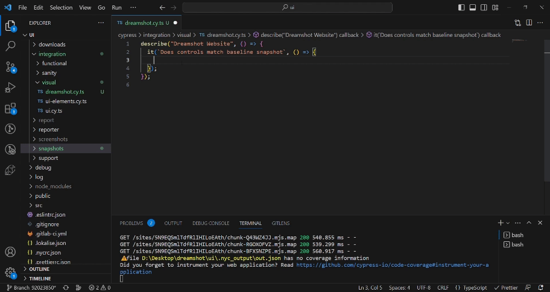

<p align="center">
  <a href="https://careers.dreamshot.bg/open-source">
    <picture>
      <source media="(prefers-color-scheme: dark)"  srcset="./assets/logo-dark.png">
      <source media="(prefers-color-scheme: light)" srcset="./assets/logo-light.png">
      
    </picture>    
  </a>
</p>
<p align="center">
  <a href="https://careers.dreamshot.bg/open-source">Documentation</a> |
  <a href="https://github.com/dreamshotrocks/cypress-lens/blob/main/CHANGELOG.md">Changelog</a>
</p>

<h3 align="center">
  The best module for visual testing for Cypress.
</h3>

<p align="center">
  <a href="https://dreamshot.bg/">
    
  </a>
</p>
<p align="center">
  Join us, we're <a href="https://careers.dreamshot.bg/careers">hiring</a>.
</p>

<p align="center">
  <a href="https://www.npmjs.com/package/cypress-lens">
    
  </a>
  <a href="https://github.com/dreamshotrocks/cypress-lens/blob/main/LICENSE">
    
  </a>
  <a href="https://github.com/semantic-release/semantic-release">
    
  </a>
  <a href="https://conventionalcommits.org">
    
  </a><br />
</p>

# Cypress Lens

Based on [Cypress Visual Regression](https://www.npmjs.com/package/cypress-visual-regression)

Module for visual regression testing and reporting for [Cypress](https://www.cypress.io/).

###### Visual Regression Demo



###### Reporter Demo


## Getting Started

Install:

```sh
$ npm install cypress-lens
```

# 1. Setup visual regression

Add the following config to your _cypress.config.js_ file:

```js
const { defineConfig } = require("cypress");
const getCompareSnapshotsPlugin = require("cypress-lens/dist/plugin");

module.exports = defineConfig({
  screenshotsFolder: "./cypress/snapshots/actual",
  trashAssetsBeforeRuns: true,
  video: false,
  e2e: {
    setupNodeEvents(on, config) {
      getCompareSnapshotsPlugin(on, config);
    },
  },
});
```

Add the command to _cypress/support/commands.js_:

```js
const compareSnapshotCommand = require("cypress-lens/dist/command");

compareSnapshotCommand();
```

> Make sure you import _commands.js_ in _cypress/support/e2e.js_:
>
> ```js
> import "./commands";
> ```

### TypeScript

_cypress/tsconfig.json_

```json
{
  "compilerOptions": {
    "types": ["cypress", "cypress-lens"]
  }
}
```

# 1. Setup reporter

Install cypress-multi-reporters:
This plugin allows us to use more than one reporters since we want to keep the cypress default spec reports.

```sh
$ npm install cypress-multi-reporters
```

Create reporter-config.json and place the following code

```json
{
  "reporterEnabled": "spec, cypress-lens"
}
```

Add the following config to your _cypress.config.js_ file:

```js
const { defineConfig } = require("cypress");
const getCompareSnapshotsPlugin = require("cypress-lens/dist/plugin");

module.exports = defineConfig({
  screenshotsFolder: "./cypress/snapshots/actual",
  trashAssetsBeforeRuns: true,
  video: false,
  e2e: {
    reporter: "cypress-multi-reporters",
    reporterOptions: {
      configFile: "reporter-config.json",
    },
    setupNodeEvents(on, config) {
      getCompareSnapshotsPlugin(on, config);
    },
  },
});
```

Also, you can avoid of creating _reporter-config.json_ just use the _cypress.config.ts_
If you are using cypress-multi-reporters more info [there](https://www.npmjs.com/package/cypress-multi-reporters)
```js
const { defineConfig } = require("cypress");
const getCompareSnapshotsPlugin = require("cypress-lens/dist/plugin");

module.exports = defineConfig({
  screenshotsFolder: "./cypress/snapshots/actual",
  trashAssetsBeforeRuns: true,
  video: false,
  e2e: {
    reporter: "cypress-multi-reporters",
    reporterOptions: {
      reporterEnabled: "spec, cypress-lens",
      cypressLensReporterOptions: {
        titlePattern: "(?<=\\[).*(?=\\])",
      },
    },
    setupNodeEvents(on, config) {
      getCompareSnapshotsPlugin(on, config);
    },
  },
});
```

# 3. How to use

```js
it("Should display the home page according to baseline snapshot", () => {
  cy.visit("www.dreamshot.bg");
  cy.compareSnapshot("home-page");
});
```

### Options

`failSilently` is enabled by default. Add the following config to your cypress.config.js file to see the errors:

```js
{
  env: {
    failSilently: false;
  }
}
```
`titlePattern` is disabled by default. If you aren't using this setting your folder's name has a title from the test title. It supports only `RegExp`.
Add the following settings in your _cypress.config.js_ into the e2e object to manage the path for snapshots:

```js
  e2e: {
    reporter: "cypress-multi-reporters",
    reporterOptions: {
      reporterEnabled: "spec, cypress-lens",
      cypressLensReporterOptions: {
        titlePattern: "(?<=\\[).*(?=\\])",
      },
    }
}
```

You can also pass default arguments to `compareSnapshotCommand()`:

```js
const compareSnapshotCommand = require("cypress-visual-regression/dist/command");

compareSnapshotCommand({
  capture: "fullPage",
});
```

These will be used by default when no parameters are passed to the compareSnapshot command.

### Take the base images:

```sh
$ ./node_modules/.bin/cypress run --env type=base"
```

### Find regressions:

```sh
$ ./node_modules/.bin/cypress run --env type=actual
```
